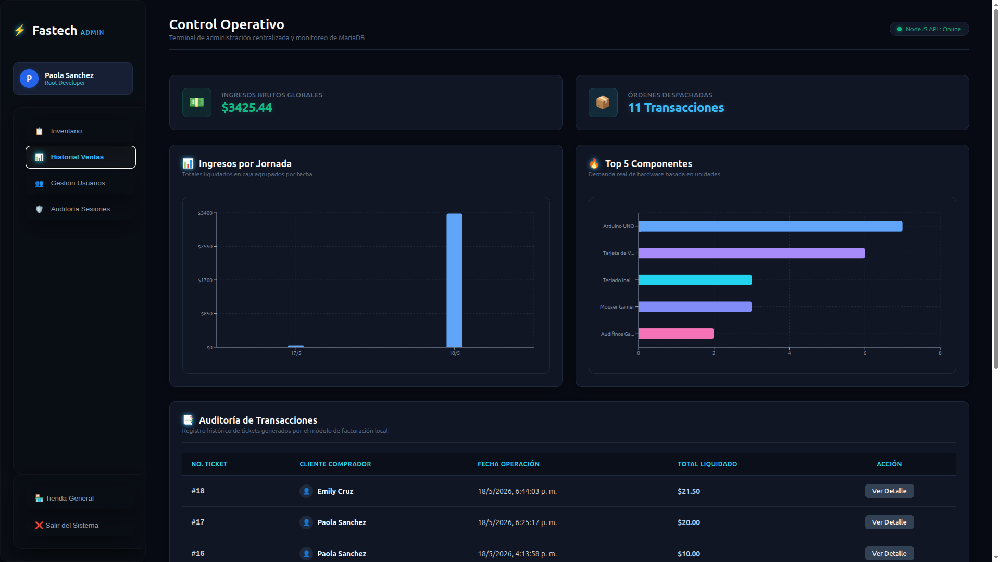
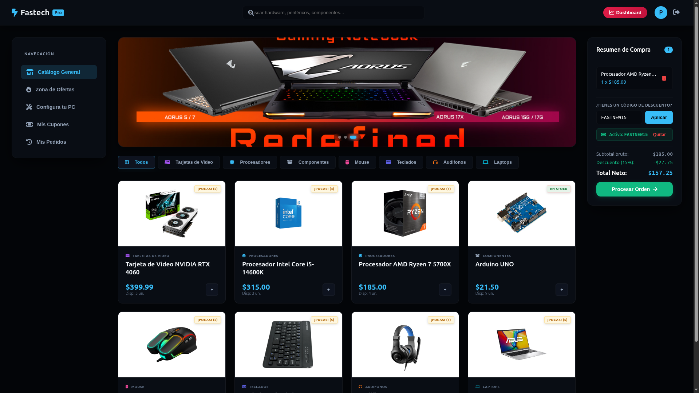
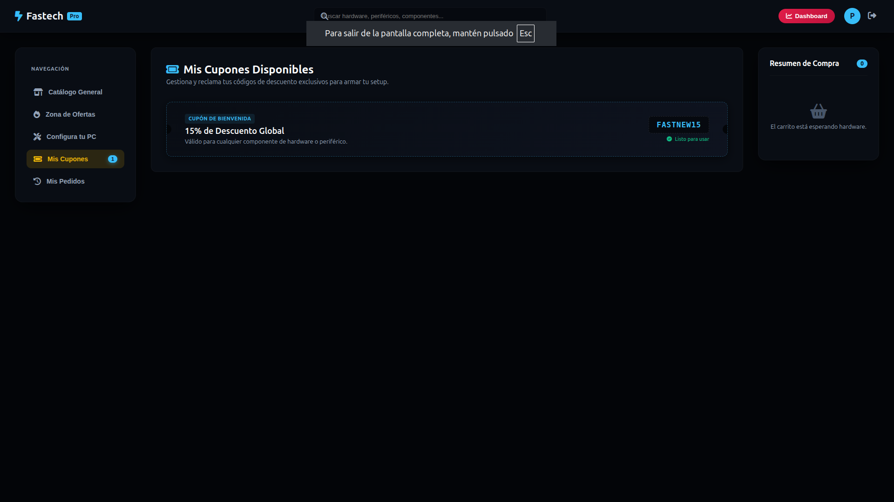
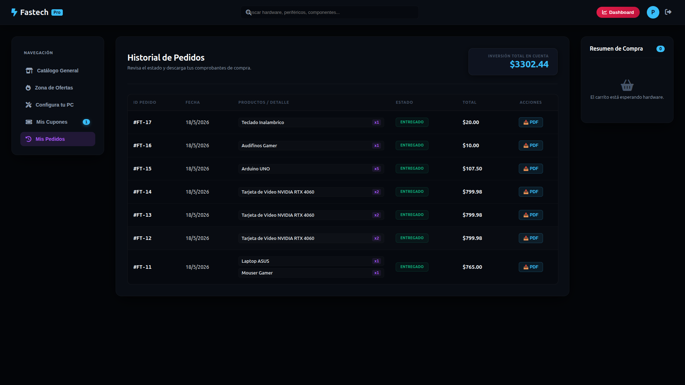
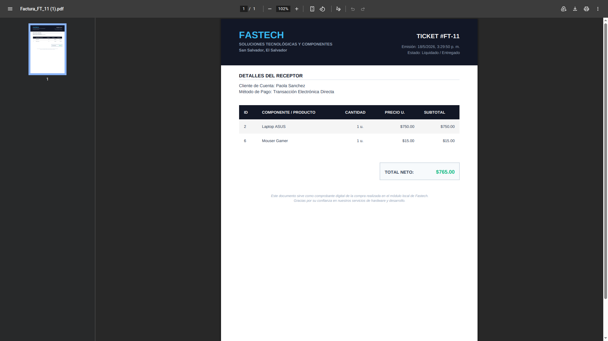
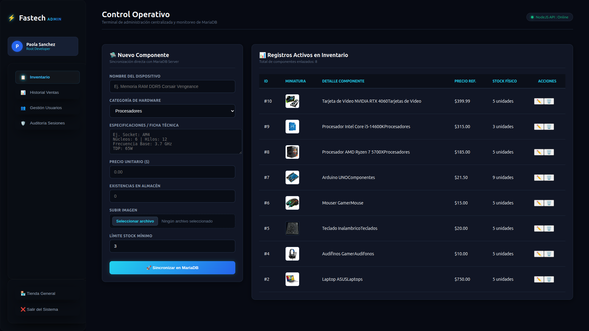
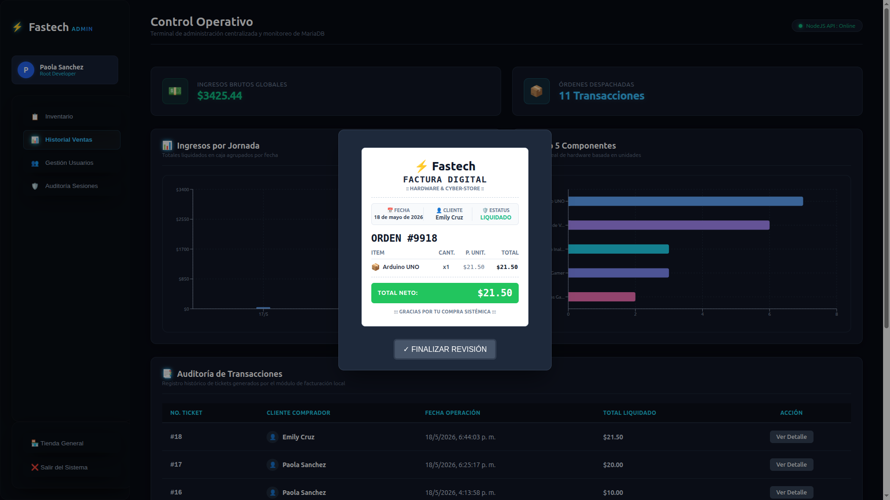
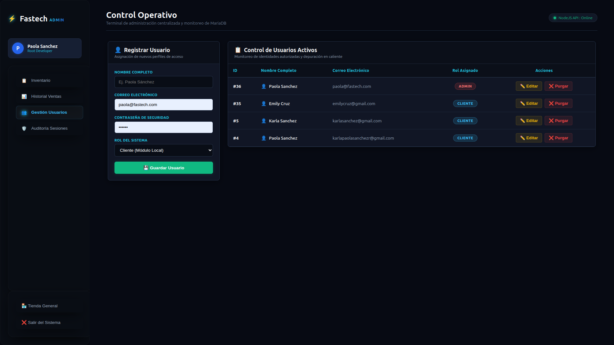
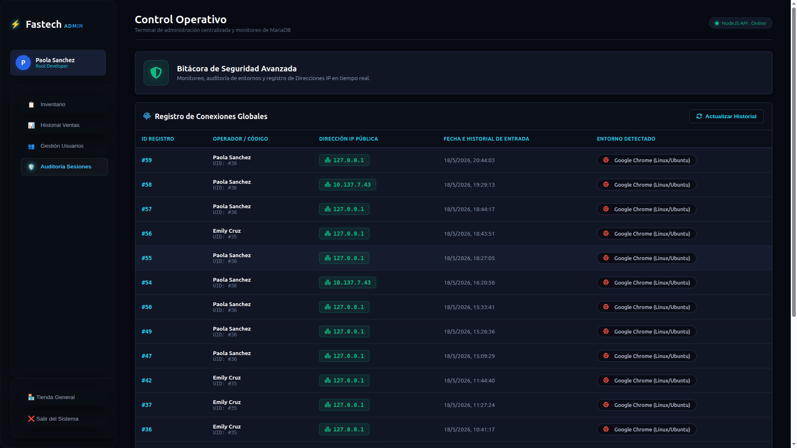
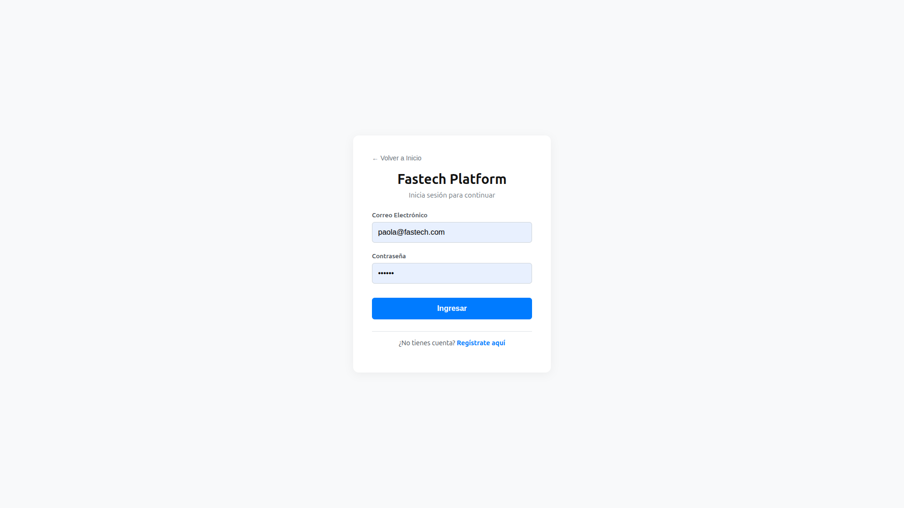

# ⚡ Fastech Platform — Full-Stack Hardware E-Commerce, ERP Inventory & Cyber-Security System

<p align="center">
  
</p>

<p align="center">
  
  
  
  
  
</p>

---

# 📖 Descripción General

Fastech es una solución de software empresarial de extremo a extremo (**Full-Stack**) diseñada para la gestión integral de un comercio electrónico de hardware y el control operativo de inventario en tiempo real mediante un entorno ERP.

El sistema implementa una arquitectura desacoplada basada en APIs RESTful, separación estricta de responsabilidades (*Separation of Concerns*) y persistencia transaccional utilizando MariaDB bajo el motor **InnoDB**.

La plataforma integra:

- Gestión avanzada de inventario
- Panel administrativo ERP
- Control de usuarios y sesiones
- Facturación electrónica PDF
- Auditoría de actividad
- Seguridad perimetral
- Sistema de cupones
- Protección contra fuerza bruta
- Comunicación Full-Stack mediante JSON

---

# 🛠️ Especificación Técnica del Stack

## 🖥️ Frontend (SPA)

- **React.js** → Construcción de interfaces dinámicas mediante componentes reutilizables.
- **Vite** → Entorno de desarrollo optimizado con Hot Module Replacement (**HMR**).
- **Tailwind CSS** → Sistema de diseño responsive basado en utilidades.
- **Context API** → Manejo global de autenticación y carrito de compras.
- **React Router DOM** → Navegación dinámica entre vistas protegidas.
- **Axios** → Comunicación asíncrona centralizada con la API REST.

---

## ⚙️ Backend (REST API)

- **Node.js** → Entorno de ejecución del servidor.
- **Express.js** → Framework modular para APIs RESTful.
- **Arquitectura MVC** → Separación entre rutas, controladores y lógica de negocio.
- **Multer** → Gestión segura de carga de imágenes.
- **PDFKit** → Generación automatizada de facturas PDF.
- **Bcrypt** → Hashing seguro de credenciales.
- **Express-Rate-Limit** → Mitigación de ataques automatizados.

---

## 🗄️ Base de Datos

- **MariaDB Server**
- Motor transaccional **InnoDB**
- Integridad referencial mediante `FOREIGN KEY`
- Persistencia de usuarios, ventas y auditorías
- Consultas agregadas (`SUM`, `COUNT`, `GROUP BY`)
- Control concurrente de stock

---

# 📂 Arquitectura del Proyecto

```text
📁 tu-proyecto-fastech/
├── 📁 backend/
│   ├── 📁 config/           # Conexión a MariaDB y variables de entorno
│   ├── 📁 controllers/      # Lógica de negocio y controladores
│   ├── 📁 middlewares/      # Seguridad, validaciones y Multer
│   ├── 📁 routes/           # Endpoints RESTful
│   └── 📄 server.js         # Punto de entrada del backend
│
├── 📁 frontend/
│   ├── 📁 src/
│   │   ├── 📁 components/   # Componentes reutilizables
│   │   ├── 📁 context/      # Context API global
│   │   ├── 📁 hooks/        # Custom Hooks
│   │   ├── 📁 layouts/      # Layouts generales
│   │   ├── 📁 pages/        # Vistas principales
│   │   ├── 📁 services/     # Consumo centralizado de API
│   │   ├── 📁 utils/        # Utilidades auxiliares
│   │   └── 📄 main.jsx      # Render principal de React
│   │
│   └── 📁 public/
│       └── 📁 screenshots/  # Capturas utilizadas en el README
│
└── 📄 README.md
```

La arquitectura fue diseñada bajo un enfoque desacoplado (*Decoupled Architecture*), separando completamente la capa cliente del backend API REST.

Esto permite:

- Escalabilidad modular
- Mantenimiento independiente
- Reutilización de componentes
- Mayor organización del código
- Mejor control de seguridad
- Facilidad de despliegue cloud

---

# 📸 Documentación Visual del Sistema

# 🛒 Módulo Comercial — Vista Cliente

---

## 1️⃣ Catálogo General de Productos

El sistema renderiza dinámicamente productos registrados en la base de datos mostrando disponibilidad, precios y stock en tiempo real.

<p align="center">
  
</p>

---

## 2️⃣ Sistema de Cupones y Descuentos

El módulo permite aplicar descuentos dinámicos utilizando manejo global de estados mediante Context API.

<p align="center">
  
</p>

---

## 3️⃣ Historial de Pedidos Asíncrono

Los usuarios autenticados pueden consultar órdenes realizadas anteriormente junto a sus comprobantes correspondientes.

<p align="center">
  
</p>

---

## 4️⃣ Facturación Electrónica PDF

El backend genera automáticamente comprobantes PDF utilizando PDFKit y datos obtenidos desde MariaDB.

<p align="center">
  
</p>

---

# 📦 Panel Administrativo (ERP Dashboard)

---

## 5️⃣ Gestión Centralizada de Inventario

El administrador puede registrar, editar y eliminar productos desde una interfaz centralizada.

<p align="center">
  
</p>

---

## 6️⃣ Dashboard Financiero y Analítica Comercial

El dashboard muestra estadísticas financieras y métricas generales del sistema.

<p align="center">
  
</p>

---

## 7️⃣ Auditoría de Transacciones Históricas

El administrador puede visualizar el detalle completo de ventas mediante modales dinámicos.

<p align="center">
  
</p>

---

## 8️⃣ Control y Gestión de Usuarios

Módulo administrativo avanzado para control de accesos y gestión de usuarios.

<p align="center">
  
</p>

---

# 🔐 Seguridad y Auditoría

---

## 9️⃣ Bitácora de Sesiones y Auditoría Forense

El sistema registra automáticamente información relacionada con accesos y actividad de usuarios.

- Dirección IP
- Fecha y hora
- Navegador y sistema operativo

<p align="center">
  
</p>

---

## 🔟 Sistema de Autenticación Segura

La plataforma implementa autenticación segura, validación de roles y mitigación contra fuerza bruta.

<p align="center">
  
</p>

---

# ⚡ Funcionalidades Implementadas

- Gestión avanzada de inventario
- ERP administrativo
- Sistema de autenticación
- Gestión de usuarios
- Dashboard financiero
- Facturación PDF
- Historial de pedidos
- Sistema de cupones
- Auditoría de actividad
- Carga segura de imágenes
- Protección mediante Rate Limiting
- Arquitectura desacoplada Full-Stack
- Diseño responsive
- Comunicación mediante API REST

---

# 🚀 Instalación y Despliegue Local

## 📋 Requisitos

- Node.js v18 o superior
- MariaDB Server
- npm

---

## 1️⃣ Configuración de Base de Datos

Crear base de datos:

```sql
CREATE DATABASE fastech_db;
```

Importar script SQL:

```sql
USE fastech_db;
SOURCE ruta_del_archivo_proyecto.sql;
```

---

## 2️⃣ Inicialización del Backend

```bash
cd backend
npm install "librerias"
node src/server.js```

Crear archivo `.env`:

```env
DB_HOST=localhost
DB_USER=root
DB_PASSWORD=tu_password_de_mariadb
DB_NAME=fastech_db
PORT=5000
```

Ejecutar servidor:

```bash
npm run dev
```

---

## 3️⃣ Inicialización del Frontend

```bash
cd frontend
npm install "librerias"
npm start
```

Abrir en navegador:

```text
http://localhost:"puerto"
```

---

# 👨‍💻 Autoría del Proyecto

Desarrollado por **Karla Paola Sánchez Rodríguez**.

Proyecto académico enfocado en:

- Desarrollo Full-Stack
- Sistemas ERP
- Gestión de inventario
- Automatización comercial
- Desarrollo seguro de software
- Ciberseguridad web